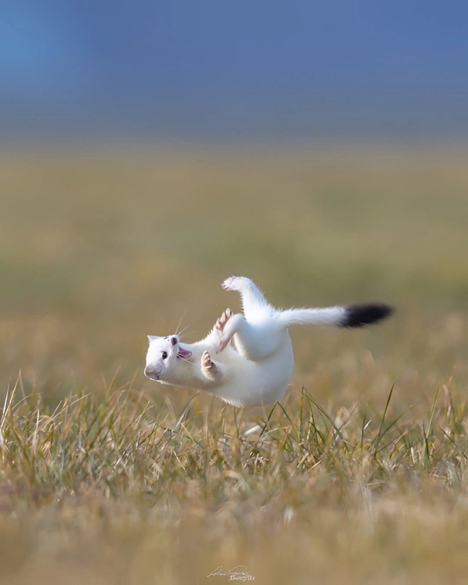

#### ML app для классификации текстов

* Использует алгоритм ```TF-IDF``` и ```Логистическую регрессию``` в качестве ```Baseline-решения.```

* Дополнительно исследованы классификаторы на основе эмбеддингов текстов ```(Применение алгоритма Word2Vec + Классификатор)```

#### \*\*\*Разработчик старался\*\*\*


